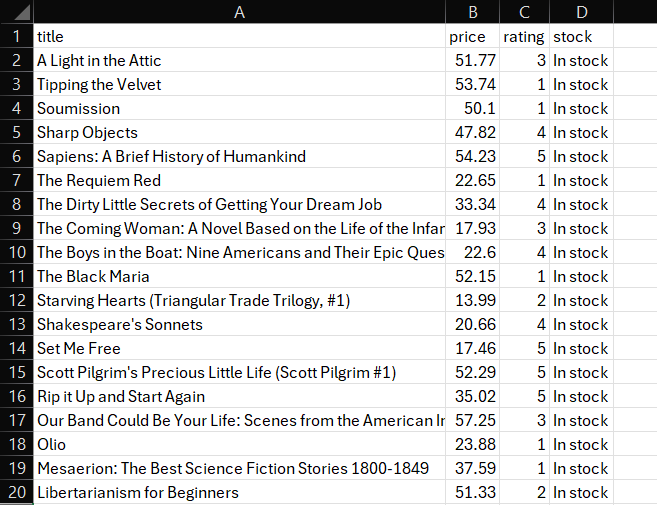

# Book scraper — 1,000 listings to clean CSV

Scrapes a bookstore catalogue across 50 paginated pages and outputs a structured CSV with prices as numbers and ratings as integers — ready for Excel or analysis with no manual cleanup.

## Output

| title | price | rating | stock |
|---|---|---|---|
| A Light in the Attic | 51.77 | 3 | In stock |
| Tipping the Velvet | 53.74 | 1 | In stock |
| Sapiens: A Brief History of Humankind | 54.23 | 5 | In stock |

1,000 rows total.



## What it handles

- Pagination across all 50 pages
- Rate limiting (1s delay between requests) to avoid straining the server
- Failed pages skipped without losing already-collected data
- Encoding forced to UTF-8 so currency symbols export cleanly to Excel
- Price converted to float, rating text converted to a 1–5 integer

## Run it

```bash
pip install requests beautifulsoup4 pandas lxml
python scraping.py
```

Output is written to `books.csv`.

## Notes

Built against [books.toscrape.com](https://books.toscrape.com), a site published for scraping practice. The same structure applies to any paginated catalogue — the selectors in `scraping.py` are the only part that changes per site.